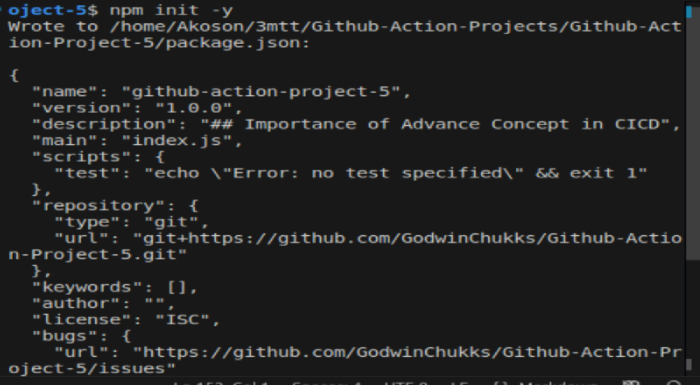
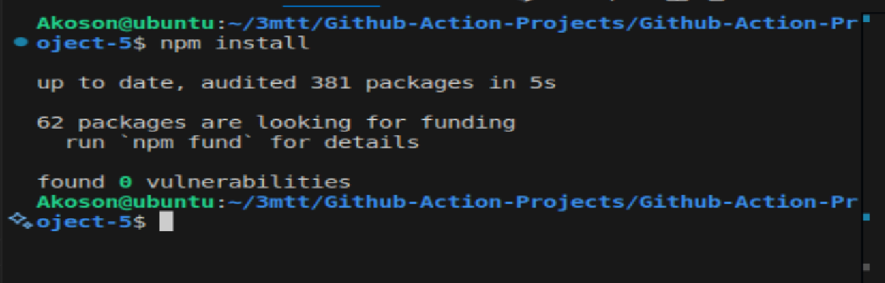
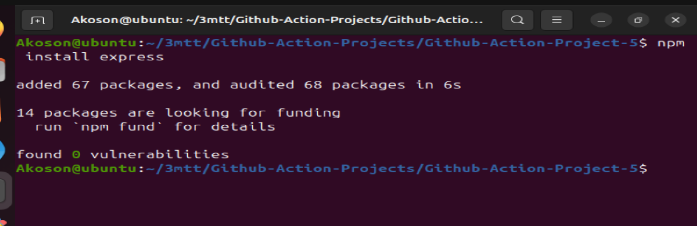
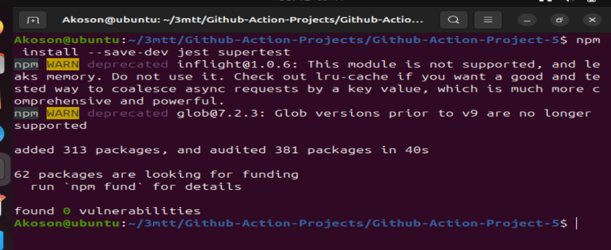
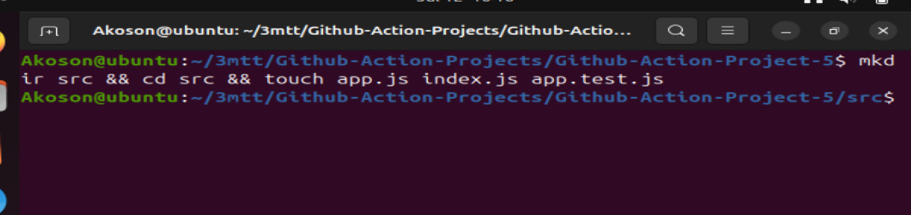
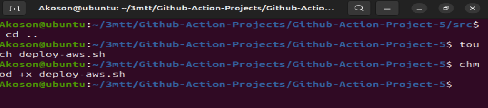

# Github-Action-Project-5

## Importance of Advance Concept in CICD

### Imagine you are an architect and builder rolled into one, constructing a skyscraper. In this analogy, the focus is on laying the foundation and building the structure — analogous to setting up basic CI/CD pipelines. As your skyscraper (software project) grows taller and more complex, the demands change. Now, you need to ensure that the building is not just strong but also efficient in resource use (optimization), safe for its occupants (security), and able to adapt to changing needs over time (modularity).

### Just like in constructing a skyscraper, in software development, you need to evolve your tools and strategies to manage more complex, larger scale, and more critical projects. Advanced GitHub Actions will ensure your CI/CD processes are like a well-designed skyscraper: robust, efficient, adaptable, and secure. This module will equip you with the expertise to build these towering structures in the digital world, ensuring your projects stand tall and strong in the ever-changing landscape of software development.

## Lesson 1: Best Practices for GitHub Actions

## Objectives:
- Understand how to write maintainable GitHub Actions workflows.
- Learn about code organization and creating modular workflows.

## Lesson Details:

### Writing Maintainable Workflows:
1. Be Clear and Descriptive:
- Name your workflows, jobs, and steps descriptively for easy understanding.
  Example: `build-and-test` not `job-1` or `step-1`.

2. Document Your Workflows:
- Use comments within the YAML file to explain the purpose and functionality of complex steps.

### Code Organization and Modular Workflows:
1. Modularize Common Tasks:
- Create reusable workflows or actions for common tasks.
- Use `uses` to reference other actions or workflows.

```yaml
jobs:
  build:
    runs-on: ubuntu-latest
    steps:
      - name: actions/checkout@v3
      - name: Install Dependencies
        run: npm install
      - name: Run Tests
        run: npm test
      - name: Run Static Analysis
        run: npm run lint


### Organize Workflow Files:

- Store workflows in the .github/workflows directory.

- Use separate files for different workflows (e.g., build.yml, deploy.yml).

## Lesson 2: Performance Optimization Objectives:

- Optimize the execution time of workflows.

- Implement caching to speed up builds.

## Optimizing Workflow Execution Time:

## Parallelize Jobs:

- Break your workflows into multiple jobs that can run in parallel.

- Use strategy.matrix for testing across multiple environments.

## Caching Dependencies for Faster Builds:

#Implement Caching:

Use the actions/cache action to cache dependencies and build outputs.

## 1. Implement Caching: 

- Use the actions/cache action to cache dependencies and build outputs.

```
- uses: actions/cache@v2
  with:
    path: |
      node_modules
      ~/.npm
    key: ${{ runner.os }}-npm-cache-${{ hashFiles('**/package-lock.json') }}
    restore-keys: |
      npm-cache

```

## This caches the npm modules based on the hash of package-lock.json.

## Lesson 3: Security Considerations

## Objectives:
- Implement security best practices in GitHub Actions.
- Secure secrets and sensitive information.

## Implementing Security Best Practices:
1. Least Privilege Principle:
   - Grant minimum permissions necessary for the workflows.
   - Regularly review and update permissions.

2. Audit and Monitor Workflow Runs:
   - Regularly check workflow run logs for unexpected behavior.

Securing Secrets and Sensitive Information:
1. Use Encrypted Secrets:
   - Store sensitive information like tokens and keys in GitHub Encrypted Secrets.

```
env:
  ACCESS_TOKEN: ${{ secrets.ACCESS_TOKEN }}
  # Use secrets as environment variables in your workflow.

```

2. Avoid Hardcoding Sensitive Information:
   - Never hardcode sensitive details like passwords directly in your workflow files.


# Project Implementation

## Step 1:

### Inside the project folder run the command:

`npm init -y`



### This set up the foundation of your Node.js project. It creates a package.json file, which tracks your dependencies, scripts, metadata, and is absolutely essential for both GitHub Actions and your local development flow.

## What npm init -y Does

- Creates a package.json file with default values

- Allows you to define scripts like "start" and "test"

- Tracks installed packages like Express and Jest

- Enables your CI workflow to run npm install and npm test

- Without package.json, your CI jobs would hit errors like:

- Run this immediately after creating your project folder at the root of project folder


## Step 2:

## Installing the Pollowing Project Packages

### 1. Installing `npm install`

This installs our project’s dependencies listed in package.json

- It installs packages (node_modules)

- Updates package-lock.json

- Can also install specific packages:



### 2. Installing `npm install express` 

### This will install `node_modules`, `package-lock.json`



### 3. Installing `npm install --save-dev jest supertest` 

## jest

- A JavaScript testing framework

- Runs your tests and gives detailed feedback

## --save-dev

- This flag adds the packages to the devDependencies section of your package.json

- They're only needed during development and testing, not in production

## supertest

- A library for testing HTTP endpoints

- Works perfectly with Express apps



### Once that’s done, our project’s ready to build, test, and deploy — smoothly and automatically


## Step 3:

### Creating our project code base files




### Step 4:

### Making deployment script executable



### Secret created for deployment to aws s3 bucket

[images](screenshot/7.PNG)

### Successful build and deployment to aws s3

[images](screenshot/8.PNG)

[images](screenshot/9.PNG)

[images](screenshot/10.PNG)


